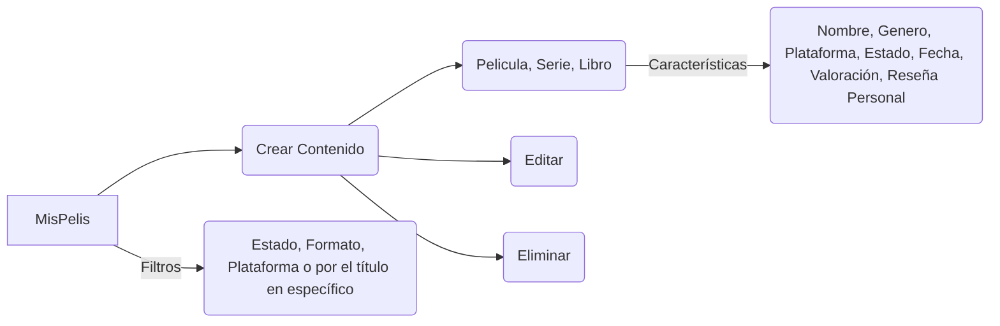
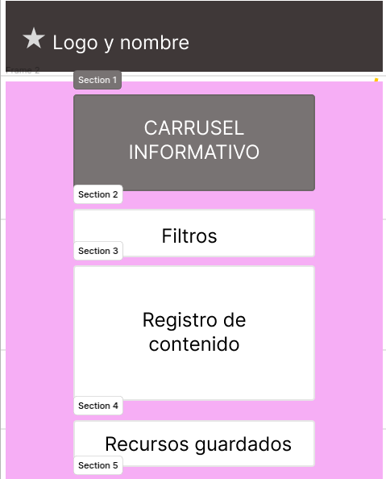
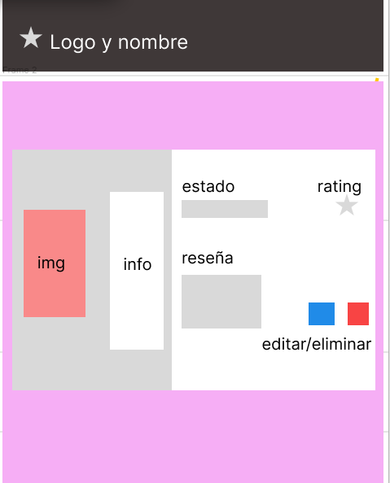

# MisPelis.resources 🎬

## Tabla de contenido
| Indice | Título  |
|--|--|
| 1. | [Descripción](#Descripcion) |
| 2. | [Caracteristicas Principales](#Caracteristicas) |
| 3. | [Tecnologias Utilizadas](#Tecnologias) |
| 4. | [Instrucciones de Ejecución](#Instrucciones-de-ejecucion) |
| 5. | [Estructuracion](#Estructuracion) |
| 6. | [Etapa de diseño](#Etapa-de-diseño) |

#### Descripcion 🚀

El proyecto MisPelis.resources consiste en una página web que ayuda a los usuarios a llevar un registro de los contenidos que ha visto o desea ver

#### Caracteristicas 🧮

1. **Crear Contenido** 🎬: Permite crear el contenido por 
- Nombre del recurso.
- Género.
- Plataforma
- Estado (En progreso, Terminado, Pendiente).
- Formato (Serie, Película, Libro).
- Fecha de terminación.
- Valoración final (1 a 5 estrellas).
- Reseña personal (comentarios sobre el recurso).

2. **Actualizar Contenido** ➰: Permite actualizar informacion del contenido

3. **Borrar Contenido** ❌ : Permite borrar la informacion creada

3. **Buscar Contenido por medio de filtros** 🔎 : Permite buscar el contenido por medio del estado, formato, plataforma o por el título en específico

#### Tecnologias  🖥️

- **HTML** 🏗️: Se estructuró la pagina con esta tecnología
- **CSS** 🖌️: Se apoyo de esta tecnología para darle estilos adicionales
- **JavaScript** 🧠: Se le dio funcionalidades de CRUD y filtrado por medio de esta tecnología
- **Bootstrap** 🎨: Se apoyo de esta tecnología para darle estilos y estructuración a la interfaz

#### Instrucciones de ejecucion 📐

- **Ve al link** 🔗 : https://juanconde025.github.io/Proyecto_JavaScript_CondeJuan/

#### Estructuracion 📄 

### Etapa de diseño 🎨

En esta etapa se tuvo un enfoque hacia la parte visual del usuario, maquetando la interfaz principal:

Y adicionalmente se le maqueto el diseño del contenido guardado:

